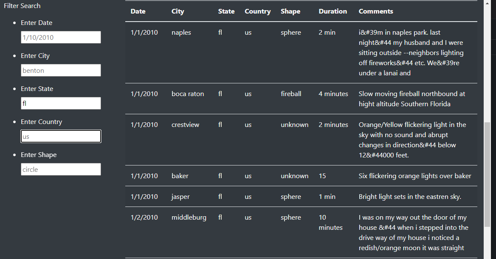

# UFOs
## Purpose
The purpose of this assignment is to use javascript and css styles to create a presentable and interactive format to share data.  
The data of ufo sigtings can be filtered to show only the data relevent to your search.
## Results

Individual filters updated on the fly for Florida  
Type the filter requirements in the white squares and see the results.  

## Summary
The drawbacks of this site, are the few. The main draw back is the comments section is limited.  
Another drawback is who reported the data is missing.  
One the changes I would implement would be to ignore capitalization. FL will not return any results but fl will.  
I would also add date ranges, for example all of january indepentant of years.
